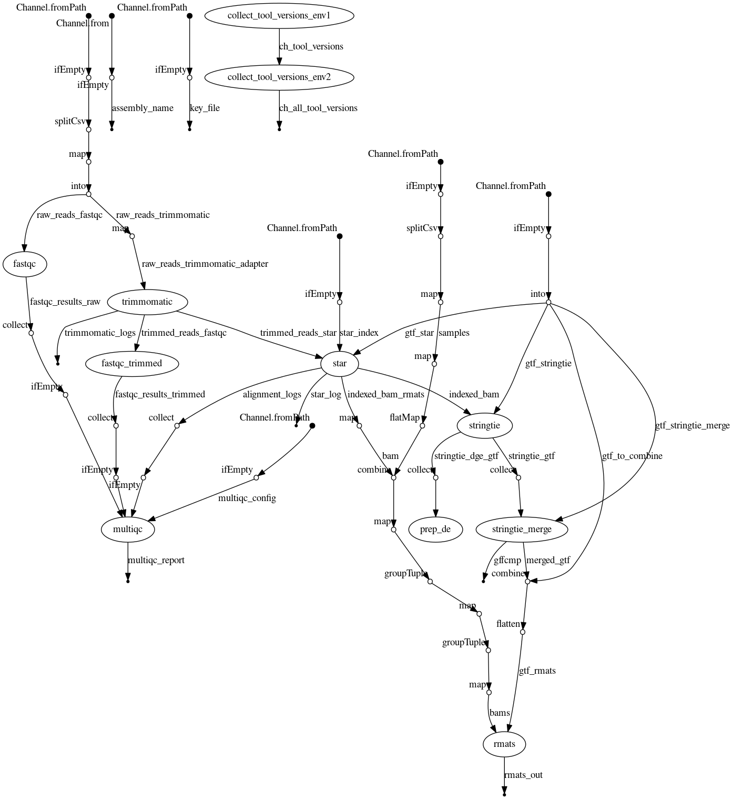

# Pipeline documentation

Table of contents

- [1 - Pipeline description](#1---pipeline-description)
  - [1.1 - Pipeline overview](#11---pipeline-overview)
  - [1.2 - Input](#12---input)
  - [1.3 - Default processes](#13---default-processes)
  - [1.4 - Optional processes](#14---optional-processes)
  - [1.5 - Output](#15---output)
- [2 - Options](#2---options)
- [3 - Usage](#3---usage) 
  - [3.1 - Running with Docker or Singularity](#31---running-with-docker-or-singularity)
  - [3.2 - Submitting run to CloudOS](#32---submitting-run-to-cloudos)
  - [3.3 - Execution examples](#33---execution-examples)
- [4 - Additional information](#4---additional-information) 
  - [4.1 - Quick Start on Sumner](#41---Quick-start-on-Sumner)
  - [4.2 - Additional documentation](#42---Additional-documentation)

## 1 - Pipeline description

### 1.1 - Pipeline overview

  - Name: splicing-pipelines-nf
  - Tools: are listed in the environment.yml files in each respective tool bundle in the folder containers/<tool> in the repo.
  - Dependencies: are listed in the [docs/dependencies.md](./docs/dependencies.md)

Anczukow-lab repository for the Nextflow splicing pipeline with `rMATS 4.1.0` (tag = v1.0) and `rMATS 4.1.1` (master). 

The pipeline is built using [Nextflow](https://www.nextflow.io), a workflow tool to run tasks across multiple compute infrastructures in a very portable manner. For example, it can be run on HPC (using [JAX](https://www.jax.org/)'s Sumner HPC) or on the cloud over ([Lifebit's CloudOS](https://lifebit.ai/cloudos) platform with AWS & GCloud). It comes with docker containers making installation trivial and results highly reproducible.


The pipeline carries out the following steps in this order:

1. Processes raw data from FastQ inputs ([FastQC](https://www.bioinformatics.babraham.ac.uk/projects/fastqc/) and [Trimmomatic](http://www.usadellab.org/cms/?page=trimmomatic)).
2. Aligns the reads with ([STAR](https://github.com/alexdobin/STAR)).
3. Performs transcript assembly and quantification with ([StringTie](https://ccb.jhu.edu/software/stringtie/))
4. Detects alternative splicing events with ([rMATs](http://rnaseq-mats.sourceforge.net/))
5. Generates an interactive QC report with ([MultiQC](http://multiqc.info/)).

The following diagram is a schematic representation of the processes performed by this pipeline and the data flow between them during a typical run:




### 1.2 - Input

The input reads to this pipeline can come from 3 input sources:


#### FASTQs Supplied directly

Input data must be provided as a comma-delimited table with a header where the first two columns must be 'sample_id' and 'fastq' specifying the ID and the path of each file. The `download_from` and `key_file` options must be set to false.

```
sample_id,fastq
SRR4238351,https://lifebit-featured-datasets.s3-eu-west-1.amazonaws.com/projects/jax/splicing-pipelines-nf/reads/ultra_quick_test/SRR4238351_subsamp.fastq.gz
SRR4238355,https://lifebit-featured-datasets.s3-eu-west-1.amazonaws.com/projects/jax/splicing-pipelines-nf/reads/ultra_quick_test/SRR4238355_subsamp.fastq.gz
SRR4238359,https://lifebit-featured-datasets.s3-eu-west-1.amazonaws.com/projects/jax/splicing-pipelines-nf/reads/ultra_quick_test/SRR4238359_subsamp.fastq.gz
SRR4238379,https://lifebit-featured-datasets.s3-eu-west-1.amazonaws.com/projects/jax/splicing-pipelines-nf/reads/ultra_quick_test/SRR4238379_subsamp.fastq.gz
```

#### TCGA

Input data must be provided as a text file with a header where the first line must be 'sample_id' followed by the UUID for each tumor ID. The `download_from` must be set to `TCGA` and the `key_file` must receive the authentication token.

```console
sample_id
7b42c9bc-265c-4492-a6d3-d73de306429b
7adf923e-6e17-4127-9320-ae83cb8eb4ae
2bf57145-58f2-4cbb-aa18-176caa1bd4fe
681cc50b-1644-4f92-a74b-963f82e15834
5af9d30a-b860-4c66-bed3-a423ca2fcdf2
1397f168-e023-42db-b9ee-daa265ee9de8
e4b8f538-77e0-43ca-857f-9e26df02b255
85593e47-25c9-4f6a-ab5d-56639ec64ef1
02e23daa-ae4c-46f2-a51b-3f3776fab20d
5406f615-e7be-4ace-83f9-ac934de63fe4
06465320-26c2-4eb8-8a9d-093239b51d41
```

More information can be found in the [docs/Running_TCGA.md](./docs/Running_TCGA.md)

#### GTEx/SRA

Input data must be provided as a text file with a header where the first line must be 'sample_id' followed by the ID for each tumor (for example the SRA ID). The `download_from` must be set to `GTEx` or `SRA`, depending on the ID passed in the input file, and the `key_file`, when using `GTEx`, must receive the dbGAP repository key.

```console
sample_id
GTEX-XXXXX-XXXX-XX-XXXXX.Aligned.sortedByCoord.out.patched.md.bam
GTEX-XXXXX-XXXX-XX-XXXXX.Aligned.sortedByCoord.out.patched.md.bam
GTEX-XXXXX-XXXX-XX-XXXXX.Aligned.sortedByCoord.out.patched.md.bam
GTEX-XXXXX-XXXX-XX-XXXXX.Aligned.sortedByCoord.out.patched.md.bam
GTEX-XXXXX-XXXX-XX-XXXXX.Aligned.sortedByCoord.out.patched.md.bam
```

### 1.3 - Default processes

- `collect_tool_versions_env1`: Collect tool versions
- `collect_tool_versions_env2`: Collect tool versions (rmats only)
- `fastqc`: FastQC for quality control of input reads
- `trimmomatic`: Trimmomatic to trim input reads
- `fastqc_trimmed`: FastQC for quality control of trimmed reads
- `multiqc`: MultiQC to generate a QC HTML report
- `star`: STAR to align trimmed reads
- `stringtie`: Stringtie for transcript assembly and quantification
- `prep_de`: Generate count matrix for all samples with prepDE.py
- `stringtie_merge`: Stringtie merge GTF files
- `rmats`: rMATS to detect alternative splicing events

### 1.4 - Optional processes

- `get_accession`: Download FASTQ files from SRA
- `get_ftp_accession`: Download FASTQ files from FTP
- `in2csv`: When using GTEx, convert json manifest file to CSV format
- `filter_manifest`: When using GTEx, filter input manifest, now in CSV format, to contain only the input samples
- `gen3_drs_fasp`: Download BAM files from GTEx
- `get_tcga_bams`: Download BAM files from TCGA
- `bamtofastq`: Bedtools to extract FASTQ from BAM

### 1.5 - Output

All outputs including secondary outputs and logs can be found in [3.3 - Execution examples](#33---execution-examples) 

<details>
<summary>Format of main outputs:</summary>

:warning: Work in Progress :warning:

</details>

## 2 - Options

### Running the pipeline

#### For running the pipeline on Sumner
See [here](run_on_sumner.md)

#### For running the pipeline on CloudOS
See [here](run_on_cloudos.md)

#### For running the pipeline locally
See [here](run_locally.md)

### Nextflow parameters

Nextflow parameters can be provided in one of two ways:
1) They can be specified in configuration files
2) They can be specified on the command-line
3) They can be specified in main.pbs

<details>
<summary>For example, all of the following are equivalent:</summary>

1) Config file
```groovy
params.reads      = '/path/to/reads.csv'
params.readlength = 48
params.singleEnd  = true
```

OR 

```groovy
params {
  reads      = '/path/to/reads.csv'
  readlength = 48
  singleEnd  = true
}
```

See [configuration scopes](https://www.nextflow.io/docs/latest/config.html#config-scopes) for more information on this^

2) Specifying parameters on the command-line
```bash
nextflow run main.nf --reads /path/to/reads.csv --readlength 48 --singleEnd true
```

</details>

Parameters specified on the command-line (or in main.pbs) take precedence over those specified in configuration files. It is generally best-practice to have your parameters saved in a configuration file as this makes your analysis more reproducible if you need to run it again.

[Profiles](https://www.nextflow.io/docs/latest/en/latest/config.html#config-profiles) are configuration that can be included by specifying the profile name on the command-line. This CANNOT be set from the configuration file. For example, `-profile sumner` to include configuration specific to JAX's HPC Sumner.

### Types of Nextflow parameters

#### String 

Strings can be specified using 'single' or "double quotes"

#### Paths

File paths can be any one of the following:
1) Local path - from directory that Nextflow is run in
2) Full path
3) Links - `https`, `ftp`, `s3` & `gs` links can all be used to specify input files provided that you have access to the file. Nextflow will automatically download these files into the `work` directory (in `work/stage`). On subsequent executions the pre-downloaded files will be used.

#### Int

Integers can be specified without using quotes both in the configuration files and on the command-line

#### Bool

Boolean parameters can be set to either `true` or `false`. Many of the parameters are initialised to `false` in [`nextflow.config`](../nextflow.config). You can set parameters to true on the command line just by using the flag. For example, just using `--singleEnd` will set the `singleEnd` parameter to true.

<details>
<summary>Side note:</summary>

However, be careful doing this as `--singleEnd false` will actually set the `singleEnd` parameter to the string `'false'` not the boolean `false`. Counterintuively, as this is a string that is present it actually mean that `singleEnd` will evaluate to true :satisfied:

This is another reason why it can be best to specify parameters in a confugration file rather than on the command-line
</details>

#### Other

Memory units eg for `max_memory` can be specified in gigabytes eg `8.GB`

Time units eg for `max_time` can be specified in hours eg `2.h`

Both of these should be specified without quotes

#### All available parameters
```
Input files:
    --reads                     Path to reads.csv file, which specifies the sample_id and path to FASTQ files
                                for each read or read pair (path).
                                When using the --download_from GTEX option the reads file must be a simple csv file listing
                                bam file names to be processed in the analysis. The input manifest will be downsampled
                                to only contain information about these files.
                                This file is used if starting at beginning of pipeline. It can be file paths,
                                s3 links or ftp link.
                                (default: no reads.csv)
    --bams                      Path to bams.csv file which specifies sample_id and path to BAM and BAM.bai
                                files (path)
                                If this file is provided, pipeline will start at Stringtie (and proceed through
                                rMATS and post processing).
                                (default: no bams.csv)
    --rmats_pairs               Path to rmats_pairs.txt file containing b1 (and b2) samples names (path)
                                (default: no rmats_pairs specified)
    --run_name                  User specified name used as prefix for output files
                                (defaut: no prefix, only date and time)
    --download_from             Database to download FASTQ/BAMs from (available = 'TCGA', 'GTEX', 'SRA', 'FTP')
                                (string)
                                false should be used to run local files on the HPC (Sumner).
                                'TCGA' can also be used to download GDC data including HCMI data.
                                (default: false)
    --manifest                  Manifest file to download data from GTEX. (string)
                                (default: false)
    --key_file                  For downloading reads, use TCGA authentication token (TCGA) or
                                credentials.json file in case of 'GTEX'.
                                (default: false)

Main arguments:
    --gtf                       Path to reference GTF file (path)
                                (default: no gtf specified)
    --assembly_name             Genome assembly name (available = 'GRCh38' or 'GRCm38', string)
                                (default: false)
    --star_index                Path to STAR index (path)
                                Star indices must be generated prior to run (with correct STAR version)
                                (default: false)
    --singleEnd                 Specifies that the input is single-end reads (bool)
                                This parameter also automatically establishes the path to the SE or PE adapters.
                                For PE, set to false.
                                (default: false)
    --stranded                  Specifies that the input is stranded ('first-strand', 'second-strand',
                                false (aka unstranded))
                                'first-strand' refers to RF/fr-firststrand in this pipeline.
                                (default: 'first-strand')
    --readlength                Read length - Note that all reads will be cropped to this length(int)
                                (default: no read length specified)
    -profile                      Configuration profile to use. Can use multiple (comma separated, string)
                                On sumner, this should be set in the main.pbs or as a command-line parameter.
                                Profile can only be activated from the command line.
                                Available: base, docker, sumner, test and more.

Trimmomatic:
    --minlen                    Drop the read if it is below a specified length (int)
                                Default parameters turn on --variable-readlength
                                To crop all reads and turn off --variable-readlength, set minlen = readlength
                                (default: 20)
    --slidingwindow             Perform a sliding window trimming approach (bool)
                                (default: true)
    --adapter                   Path to adapter file (path)
                                (default: TruSeq3 for either PE or SE, see singleEnd parameter)

Star:
    --mismatch                  Number of allowed mismatches per read (SE) or combined read (PE) (int)
                                SE ex. read length of 50, allow 2 mismatches per 50 bp
                                PE ex. read length of 50, allow 2 mismatches per 100 bp
                                (default: 2)
    --overhang                  Overhang (int)
                                (default: readlength - 1)
    --filterScore               Controls --outFilterScoreMinOverLread and outFilterMatchNminOverLread
                                For TCGA values:
                                https://docs.gdc.cancer.gov/Data/Bioinformatics_Pipelines/Expression_mRNA_Pipeline/
                                (default: 0.66)
    --sjdbOverhangMin           Controls --alignSJDBoverhangMin (int)
                                For TCGA values:
                                https://docs.gdc.cancer.gov/Data/Bioinformatics_Pipelines/Expression_mRNA_Pipeline/
                                (default: 3)
    --soft_clipping             Enables soft clipping (bool)
                                If true, the STAR parameter will be --alignEndsType 'Local' and the rMATS parameter
                                --allow-clipping will be added.
                                If false, the STAR parameter will be --alignEndsType 'EndToEnd' and no rMATS
                                parameter is added.
                                NOTE: Soft Clipping will cause read lengths to be variable, so turn soft_clipping
                                off if reads need to be same length. Variable read length parameter is turned on
                                in rMATS when minlen does not equal readlength.
                                (default: true)
    --save_unmapped             Save unmapped and partially mapped reads in separate file (bool)
                                (default: false)
    --star_memory               Max memory to be used by STAR to sort BAM files.
                                (default: Available task memory)

rMATS:
    --statoff                   Skip the statistical analysis (bool)
                                If using only b1 as input, this must be turned on.
                                (default: false)
    --paired_stats              Use the paired stats model (bool)
                                (default: false)
    --novelSS                   Enable detection of unnanotated splice sites (bool)
                                (default: false)
    --mil                       Minimum Intron Length. Only impacts --novelSS behavior (int)
                                (default: 50)
    --mel                       Maximum Exon Length. Only impacts --novelSS behavior (int)
                                (default: 500)
    --rmats_merge_memory          Sets base RAM requirement for stringtie_merge process.
                                (default: 120.GB)
    --rmats_merge_cpu             Sets base CPU requirement for stringtie_merge process.
                                (default: 30)
    --rmats_merge_machine_type    Only specific to google-cloud executor. Request a specific machine type for rmats.

Stringtie:
    --stringtie_merge_memory      Sets base RAM requirement for stringtie_merge process.
                                (default: 30.GB)
    --stringtie_merge_cpu         Sets base CPU requirement for stringtie_merge process.
                                (default: 8)
    --stringtie_merge_machine_type Only specific to google-cloud executor. Request a specific machine type 
                                    for stringtie_merge.

Other:
    --test                      For running trim test (bool)
                                To run the first half of the pipeline (through STAR), set test = true.
                                (default: false)
    --max_cpus                  Maximum number of CPUs (int)
                                (default: 72)
    --max_memory                Maximum memory (memory unit)
                                (default: 760.GB)
    --max_time                  Maximum time (time unit)
                                (default: 72.h)
    --skiprMATS                 Skip rMATS (bool)
                                (default: false)
    --skipMultiQC               Skip MultiQC (bool)
                                (default: false)
    --outdir                    The output directory where the results will be saved (string)
                                On Sumner, this must be set in the main.pbs or via command line.
                                NF_splicing_pipeline.config will not overwrite main.pbs.
                                (default: <directory where you submit the job>/results)
    --mega_time                 Sets time limit for processes withLabel 'mega_memory' in the main.nf using the
                                base.config (time unit)
                                Make sure '#SBATCH -t' in 'main.pbs' is appropriately set if you are changing this parameter.
                                (default: 20.h)
    --gc_disk_size              Only specific to google-cloud executor. Adds disk-space for few aggregative processes.
                                (default: "200 GB" based on 100 samples. Simply add 2 x Number of Samples)
    --debug                     This option will enable echo of script execution into STDOUT with some additional
                                resource information (such as machine type, memory, cpu and disk space)
                                (default: false)
    --error_strategy            Mode of pipeline handling failed processes.
                                Possible values: 'terminate', 'finish', 'ignore', 'retry'.
                                Check nextflow documentation for detailed descriptions of each mode:
                                https://www.nextflow.io/docs/latest/process.html#process-page-error-strategy
                                Set this parameter in the main.pbs, on the command line, or see NF_splicing_pipeline.config
                                example (does not work like normal config param)
                                This does not overwrite CloudOS config, which is set to:
                                'errorStrategy = { task.exitStatus in [3,9,10,14,143,137,104,134,139] ? 'retry': 'ignore'}
                                (default (non-cloudos): 'finish')
    --cleanup                   This option will enable nextflow work folder cleanup upon pipeline successfull
                                completion. All intermediate files from nexftlow processes' workdirs will be
                                cleared, staging folder with staged files will not be cleared.
                                If pipeline is completed with errors or interrupted cleanup will not be executed.
                                Following successfull run resumed from the failed run with --cleanup option enabled
                                will only clear folders of processess created in the latest run, it will not clear
                                cached folders coming from previous pipleine runs.
                                Set this parameter in the main.pbs, on the command line, or see NF_splicing_pipeline.config
                                example (does not work like normal config param)
                                (default non-cloudos: true; cloudos: false)
```

### Useful Nextflow options

Whereas parameters are set on the command-line using double dash options eg `--reads`, parameters passed to Nextflow itself can be provided with single-dash options eg `-profile`.

You can see some of these options [here](https://www.nextflow.io/docs/latest/tracing.html) in the Nextflow documentation.

Some useful ones include (specified in main.pbs):
- `-resume` which will [resume](https://www.nextflow.io/docs/latest/getstarted.html?highlight=resume#modify-and-resume) any cached processes that have not been changed
- `-with-trace` eg `-with-trace trace.txt` which gives a [trace report](https://www.nextflow.io/docs/latest/tracing.html?highlight=dag#trace-report) for resource consumption by the pipeline
- `-with-dag` eg `-with-dag flowchart.png` which produces the [DAG visualisation](https://www.nextflow.io/docs/latest/tracing.html?highlight=dag#dag-visualisation) graph showing each of the different processes and the connections between them (the channels)

## 3 - Usage 

Inside the folder [conf/](../conf) pre-curated configurations of parameters to execute the pipeline in different modes are provided.
Every configuration file can be run by calling the appropriate profile in Nextflow's `-profile` option.

> NOTE: Appending `docker` or `singularity` to the chosen profile is required because all of the dependencies are used from the containers.

### 3.1 - Running with Docker or Singularity

### Running with Docker

```bash
nextflow run main.nf -profile <any-profile>,docker
```

Example:

```bash
nextflow run main.nf -profile test_input_plink,docker
```

### Running with Singularity

```bash
nextflow run main.nf -profile <any-profile>,singularity
```

Example:

```bash
nextflow run main.nf -profile test_input_plink,singularity
```

## Running with profiles

A collection of `profiles` are already configured for this pipeline. Profile functionality allows you to use more than
one configuration file at a time.

Example:

```bash
# Equivalent to nextflow run main.nf --config conf/examples/sra_test.config -with-singularity
nextflow run main.nf -profile sra_test,singularity
```

Available profiles:

- `standard`: uses `--config`, set by default to `conf/executors/google.config`.
- `docker`: enables docker. Equivalent to `-with-docker` parameter.
- `base`: uses `conf/executors/base.config`.
- `sumner`: uses `conf/executors/base.config` and `conf/executors/sumner.config`.
- `singularity`: uses `conf/executors/singularity.config`.
- `MYC_MCF10A_0h_vs_MYC_MCF10A_8h`: uses `conf/examples/MYC_MCF10A_0h_vs_MYC_MCF10A_8h.config`.
- `ultra_quick_test`: uses `conf/examples/ultra_quick_test.config`.
- `sra_test`: uses `conf/examples/sra_test.config`.
- `sra_test_paired`: uses `conf/examples/sra_test_paired.config`.
- `sra_test_single`: uses `conf/examples/sra_test_single.config`.

### 3.2 - Submitting run to CloudOS
Running with cloudos-cli to submit to CloudOS platform on AWS

#### Set up of environmental variables

This step only needs to be set up once. More detailed information for the `cloudos-cli` package required and optional parameters can be found in the official documentation, at https://github.com/lifebit-ai/cloudos-cli.

```bash
# Workspace specific variables
MY_API_KEY="**"
WORKSPACE_ID="**"
CLOUDOS_URL="**"
PROJECT_NAME="**"

# Workflow specific variables
WORKFLOW_NAME="gwas-nf"

CLOUDOS_CLI_OPTIONS=" --cloudos-url $CLOUDOS_URL --apikey $MY_API_KEY --workspace-id $WORKSPACE_ID --workflow-name $WORKFLOW_NAME --project-name $PROJECT_NAME"
CLOUDOS_CLI_OPTIONS+=" --resumable --spot --batch"
```

#### Installation of `cloudos-cli`

General installation instructions can be found in https://github.com/lifebit-ai/cloudos-cli#from-github.

##### Pre-installed cloudos-cli in the HPC

Ask from your system administrator to install the package based on the official documentation. If already available in your system, you can type the commands below to verify that the package is successfully installed:

```bash
ml load cloudos
cloudos --version
```

The output will display the version of `cloudos-cli` you are using.

```console
cloudos, version <SELECTED VERSION IN USE>
```

#### Running from pre-build docker image

> NOTE: For convenience and ensuring the commands are being executing from the same network as the jobs that will be submitted, to ensure access to Lifebit CloudOS services is successful, you can use a terminal in a JupyterLab session within the Lifebit CloudOS platform. Docker is already available, and hence you can use the `cloudos-cli` from the pre-built image that is provided in the `cloudos-cli` documentation.

```bash
docker run --rm -it quay.io/lifebitaiorg/cloudos-cli:<TAG>
```

#### Execution command

After passing all the required environmental variables in $CLOUDOS_CLI_OPTIONS, the command to submit programmatically a job to the Lifebit CloudOS Platform can be condensed to:

```bash
cloudos job run --nextflow-profile <any-profile> $CLOUDOS_CLI_OPTIONS
```

### 3.3 - Execution examples

#### Ultra quick test

```bash
nextflow run main.nf -profile ultra_quick_test,docker
nextflow run main.nf -profile ultra_quick_test,singularity
cloudos job run --nextflow-profile ultra_quick_test $CLOUDOS_CLI_OPTIONS
```

<details>
<summary>Expected output:</summary>


```
Results tree view:
results
├── MultiQC
│   ├── 11-10-22_multiqc_report.html
│   ├── multiqc_data
│   │   ├── multiqc.log
│   │   ├── multiqc_data.json
│   │   ├── multiqc_fastqc.txt
│   │   ├── multiqc_fastqc_1.txt
│   │   ├── multiqc_general_stats.txt
│   │   ├── multiqc_sources.txt
│   │   ├── multiqc_star.txt
│   │   └── multiqc_trimmomatic.txt
│   ├── multiqc_report.html
│   └── trimmomatic
│       ├── SRR4238351_trimmomatic.log
│       ├── SRR4238355_trimmomatic.log
│       ├── SRR4238359_trimmomatic.log
│       └── SRR4238379_trimmomatic.log
├── QC
│   ├── raw
│   │   ├── SRR4238351_subsamp_fastqc.html
│   │   ├── SRR4238351_subsamp_fastqc.zip
│   │   ├── SRR4238355_subsamp_fastqc.html
│   │   ├── SRR4238355_subsamp_fastqc.zip
│   │   ├── SRR4238359_subsamp_fastqc.html
│   │   ├── SRR4238359_subsamp_fastqc.zip
│   │   ├── SRR4238379_subsamp_fastqc.html
│   │   └── SRR4238379_subsamp_fastqc.zip
│   └── trimmed
│       ├── SRR4238351_trimmed_fastqc.html
│       ├── SRR4238351_trimmed_fastqc.zip
│       ├── SRR4238355_trimmed_fastqc.html
│       ├── SRR4238355_trimmed_fastqc.zip
│       ├── SRR4238359_trimmed_fastqc.html
│       ├── SRR4238359_trimmed_fastqc.zip
│       ├── SRR4238379_trimmed_fastqc.html
│       └── SRR4238379_trimmed_fastqc.zip
├── pipeline_info
│   ├── execution_report.html
│   ├── execution_timeline.html
│   ├── execution_trace.txt
│   └── pipeline_dag.dot
├── process-logs
│   ├── collect_tool_versions_env1
│   │   └── command-logs-af2ca9
│   │       ├── .command.err
│   │       ├── .command.log
│   │       └── .command.sh
│   ├── collect_tool_versions_env2
│   │   └── command-logs-8b9814
│   │       ├── .command.err
│   │       ├── .command.log
│   │       └── .command.sh
│   ├── fastqc
│   │   ├── SRR4238351
│   │   │   └── command-logs-9333fe
│   │   │       ├── .command.err
│   │   │       ├── .command.log
│   │   │       └── .command.sh
│   │   ├── SRR4238355
│   │   │   └── command-logs-dc2fbd
│   │   │       ├── .command.err
│   │   │       ├── .command.log
│   │   │       └── .command.sh
│   │   ├── SRR4238359
│   │   │   └── command-logs-6f8965
│   │   │       ├── .command.err
│   │   │       ├── .command.log
│   │   │       └── .command.sh
│   │   └── SRR4238379
│   │       └── command-logs-1c3dc1
│   │           ├── .command.err
│   │           ├── .command.log
│   │           └── .command.sh
│   ├── fastqc_trimmed
│   │   ├── SRR4238351
│   │   │   └── command-logs-a7a4a1
│   │   │       ├── .command.err
│   │   │       ├── .command.log
│   │   │       └── .command.sh
│   │   ├── SRR4238355
│   │   │   └── command-logs-40f2c6
│   │   │       ├── .command.err
│   │   │       ├── .command.log
│   │   │       └── .command.sh
│   │   ├── SRR4238359
│   │   │   └── command-logs-fd7504
│   │   │       ├── .command.err
│   │   │       ├── .command.log
│   │   │       └── .command.sh
│   │   └── SRR4238379
│   │       └── command-logs-0ec8af
│   │           ├── .command.err
│   │           ├── .command.log
│   │           └── .command.sh
│   ├── multiqc
│   │   └── command-logs-e6f8c9
│   │       ├── .command.err
│   │       ├── .command.log
│   │       └── .command.sh
│   ├── star
│   │   ├── SRR4238351
│   │   │   └── command-logs-f390b3
│   │   │       ├── .command.err
│   │   │       ├── .command.log
│   │   │       └── .command.sh
│   │   ├── SRR4238355
│   │   │   └── command-logs-e0d20c
│   │   │       ├── .command.err
│   │   │       ├── .command.log
│   │   │       └── .command.sh
│   │   ├── SRR4238359
│   │   │   └── command-logs-9bf7b9
│   │   │       ├── .command.err
│   │   │       ├── .command.log
│   │   │       └── .command.sh
│   │   └── SRR4238379
│   │       └── command-logs-e3f18e
│   │           ├── .command.err
│   │           ├── .command.log
│   │           └── .command.sh
│   └── trimmomatic
│       ├── SRR4238351
│       │   └── command-logs-16a00d
│       │       ├── .command.err
│       │       ├── .command.log
│       │       └── .command.sh
│       ├── SRR4238355
│       │   └── command-logs-32fa10
│       │       ├── .command.err
│       │       ├── .command.log
│       │       └── .command.sh
│       ├── SRR4238359
│       │   └── command-logs-d6a2d4
│       │       ├── .command.err
│       │       ├── .command.log
│       │       └── .command.sh
│       └── SRR4238379
│           └── command-logs-d42d74
│               ├── .command.err
│               ├── .command.log
│               └── .command.sh
├── star_mapped
│   ├── SRR4238351
│   │   ├── SRR4238351.Aligned.sortedByCoord.out.bam
│   │   ├── SRR4238351.Aligned.sortedByCoord.out.bam.bai
│   │   ├── SRR4238351.Log.final.out
│   │   ├── SRR4238351.Log.out
│   │   ├── SRR4238351.Log.progress.out
│   │   ├── SRR4238351.ReadsPerGene.out.tab
│   │   └── SRR4238351.SJ.out.tab
│   ├── SRR4238355
│   │   ├── SRR4238355.Aligned.sortedByCoord.out.bam
│   │   ├── SRR4238355.Aligned.sortedByCoord.out.bam.bai
│   │   ├── SRR4238355.Log.final.out
│   │   ├── SRR4238355.Log.out
│   │   ├── SRR4238355.Log.progress.out
│   │   ├── SRR4238355.ReadsPerGene.out.tab
│   │   └── SRR4238355.SJ.out.tab
│   ├── SRR4238359
│   │   ├── SRR4238359.Aligned.sortedByCoord.out.bam
│   │   ├── SRR4238359.Aligned.sortedByCoord.out.bam.bai
│   │   ├── SRR4238359.Log.final.out
│   │   ├── SRR4238359.Log.out
│   │   ├── SRR4238359.Log.progress.out
│   │   ├── SRR4238359.ReadsPerGene.out.tab
│   │   └── SRR4238359.SJ.out.tab
│   ├── SRR4238379
│   │   ├── SRR4238379.Aligned.sortedByCoord.out.bam
│   │   ├── SRR4238379.Aligned.sortedByCoord.out.bam.bai
│   │   ├── SRR4238379.Log.final.out
│   │   ├── SRR4238379.Log.out
│   │   ├── SRR4238379.Log.progress.out
│   │   ├── SRR4238379.ReadsPerGene.out.tab
│   │   └── SRR4238379.SJ.out.tab
│   └── all_bigwig
│       ├── SRR4238351.bw
│       ├── SRR4238355.bw
│       ├── SRR4238359.bw
│       └── SRR4238379.bw
└── tool-versions
    └── env2
        └── tool_versions.txt

58 directories, 124 files
```

</details>
<br>

#### SRA run test

```bash
nextflow run main.nf -profile sra_test,docker
nextflow run main.nf -profile sra_test,singularity
cloudos job run --nextflow-profile sra_test $CLOUDOS_CLI_OPTIONS
```

<details>
<summary>Expected output:</summary>


```
Results tree view:
results
├── MultiQC
│   ├── 11-10-22_multiqc_report.html
│   ├── multiqc_data
│   │   ├── multiqc.log
│   │   ├── multiqc_data.json
│   │   ├── multiqc_fastqc.txt
│   │   ├── multiqc_fastqc_1.txt
│   │   ├── multiqc_general_stats.txt
│   │   ├── multiqc_sources.txt
│   │   ├── multiqc_star.txt
│   │   └── multiqc_trimmomatic.txt
│   ├── multiqc_report.html
│   └── trimmomatic
│       └── ERR4667735_trimmomatic.log
├── QC
│   ├── raw
│   │   ├── ERR4667735_fastqc.html
│   │   └── ERR4667735_fastqc.zip
│   └── trimmed
│       ├── ERR4667735_trimmed_fastqc.html
│       └── ERR4667735_trimmed_fastqc.zip
├── pipeline_info
│   ├── execution_report.html
│   ├── execution_timeline.html
│   ├── execution_trace.txt
│   └── pipeline_dag.dot
├── process-logs
│   ├── collect_tool_versions_env1
│   │   └── command-logs-f7f3f6
│   │       ├── .command.err
│   │       ├── .command.log
│   │       └── .command.sh
│   ├── collect_tool_versions_env2
│   │   └── command-logs-ab6095
│   │       ├── .command.err
│   │       ├── .command.log
│   │       └── .command.sh
│   ├── fastqc
│   │   └── ERR4667735
│   │       └── command-logs-777e75
│   │           ├── .command.err
│   │           ├── .command.log
│   │           └── .command.sh
│   ├── fastqc_trimmed
│   │   └── ERR4667735
│   │       └── command-logs-dfed7b
│   │           ├── .command.err
│   │           ├── .command.log
│   │           └── .command.sh
│   ├── get_ftp_accession
│   │   └── ERR4667735
│   ├── multiqc
│   │   └── command-logs-dcb4da
│   │       ├── .command.err
│   │       ├── .command.log
│   │       └── .command.sh
│   ├── star
│   │   └── ERR4667735
│   │       └── command-logs-ade133
│   │           ├── .command.err
│   │           ├── .command.log
│   │           └── .command.sh
│   └── trimmomatic
│       └── ERR4667735
│           └── command-logs-99017d
│               ├── .command.err
│               ├── .command.log
│               └── .command.sh
├── star_mapped
│   ├── ERR4667735
│   │   ├── ERR4667735.Aligned.sortedByCoord.out.bam
│   │   ├── ERR4667735.Aligned.sortedByCoord.out.bam.bai
│   │   ├── ERR4667735.Log.final.out
│   │   ├── ERR4667735.Log.out
│   │   ├── ERR4667735.Log.progress.out
│   │   ├── ERR4667735.ReadsPerGene.out.tab
│   │   └── ERR4667735.SJ.out.tab
│   └── all_bigwig
│       └── ERR4667735.bw
└── tool-versions
    └── env2
        └── tool_versions.txt

33 directories, 49 files
```

</details>

## 4 - Additional information

### 4.1 - Quick start on Sumner

#### Download latest changes to pipeline 

1) Go into splicing pipeline folder 
```bash
cd /projects/anczukow-lab/splicing_pipeline/splicing-pipelines-nf
```

2) `status` to check branch and if there are unmerged changes. *Note*: `master` is the main branch. 

```bash
git status
```

3) `pull` any new changes. *Note*: you will need your github username and password

```bash
git pull
```

#### Run test example to ensure the pipeline is working properly. 

##### Human test

1) Create new directory to run test and `cd` into that folder. Make this folder in individual's folder within `anczukow-lab`

2) Run test: 

```bash
sbatch /projects/anczukow-lab/splicing_pipeline/splicing-pipelines-nf/examples/human_test/human_test_main.pbs
```
3) To check progress: 

```bash
squeue -u [username]
```

or by looking at tail of output file: 

```bash
tail splicing.[jobnumber].out
```

#### To see the help message
```
nextflow run main.nf --help
```

### 4.2 - Additional documentation

Documentation about the pipeline, found in the [`docs/`](docs) directory:

1. Intros to
    * [Containers](./docs/containers.md)
    * [GitHub](./docs/github.md)
2. [Pipeline overview](./docs/pipeline_overview.md)
3. [Running the pipeline](./docs/usage.md)
    * [Running on Sumner](./docs/run_on_sumner.md)
    * [Running on CloudOS](./docs/run_on_cloudos.md)
    * [Running locally](./docs/run_locally.md)
